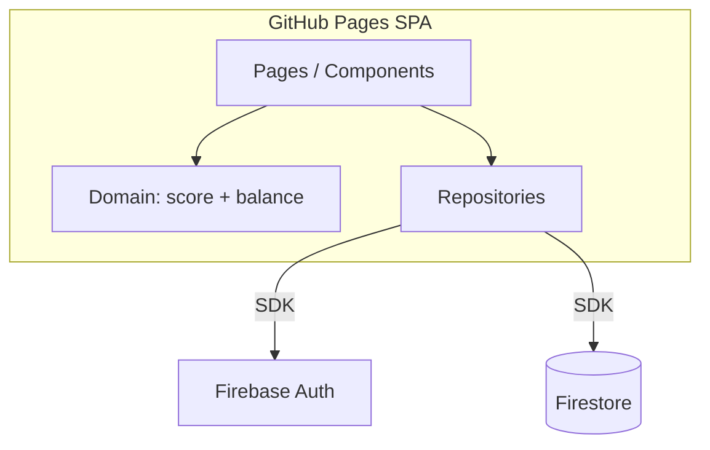

# MVP Equilíbrio — Design

**Spec**: `.specs/features/mvp-equilibrio/spec.md`  
**Context**: `.specs/features/mvp-equilibrio/context.md`  
**Status**: Approved

---

## Architecture Overview

SPA **React + Vite** no GitHub Pages, falando direto com **Firebase Auth + Firestore**. Sem backend próprio e sem Cloud Functions no MVP.

Camadas:

1. **UI** — páginas + componentes de domínio (sliders, estados, gráfico)
2. **Domain** — funções puras (`scoreStatus`, `isBalanced`) testáveis sem Firebase
3. **Data** — repositórios Firestore + Auth hooks
4. **Infra** — Firebase init, env, deploy Pages



**Abordagem escolhida (única viável com stack já decidida):** client-owned state + subcoleções por `uid`. Alternativas descartadas: Cloud Functions (custo/complexidade), Realtime Database (menos flexível para queries de histórico), HashRouter-only (URLs feias) — usamos BrowserRouter + fallback `404.html`.

---

## Code Reuse Analysis

### Existing Components to Leverage

| Component | Location | How to Use |
| --------- | -------- | ---------- |
| — | Repo greenfield | Nada a reutilizar ainda |

### Integration Points

| System | Integration Method |
| ------ | ------------------ |
| Firebase Auth | `signInWithPopup` (Google), `signInWithEmailAndPassword` / `createUserWithEmailAndPassword` |
| Firestore | Subcoleções `users/{uid}/areas` e `users/{uid}/events` |
| GitHub Pages | `base` Vite = nome do repo; Actions build + deploy; SPA `404.html` |
| shadcn/ui | `Slider`, `Button`, `Input`, `Dialog`, `DropdownMenu`, `Toaster` — estilizados com tokens dark |
| Recharts | `LineChart` no histórico |

---

## Folder Structure

```
src/
  app/
    App.tsx
    routes.tsx
    providers.tsx          # AuthProvider, Theme
  pages/
    LoginPage.tsx
    HomePage.tsx
    HistoryPage.tsx
    AreasManagePage.tsx
  components/
    ui/                    # shadcn
    balance/
      BalanceStatus.tsx    # "Equilibrado" / pedido de atenção
      AreaRail.tsx         # coluna: nome + slider vertical + estado
      AreaSlider.tsx       # wrapper do slider 0–10
    history/
      AreaScoreChart.tsx
      RangeToggle.tsx      # 7d / 30d / all
    layout/
      AppShell.tsx
      Nav.tsx
  domain/
    score.ts               # clamp, statusFromScore, SCORE_MIN/MAX
    balance.ts             # isBalanced(areas)
    labels.ts              # microcopy por estado
  data/
    firebase.ts
    auth.ts
    areasRepo.ts
    eventsRepo.ts
  hooks/
    useAuth.ts
    useAreas.ts
    useSetAreaScore.ts
    useAreaHistory.ts
  lib/
    utils.ts
    dates.ts
```

---

## Components

### AuthGate / LoginPage

- **Purpose**: Exigir sessão; Google + e-mail/senha (login e registro simples).
- **Location**: `src/pages/LoginPage.tsx`, `src/hooks/useAuth.ts`
- **Interfaces**:
  - `signInGoogle(): Promise<void>`
  - `signInEmail(email, password): Promise<void>`
  - `signUpEmail(email, password): Promise<void>`
  - `signOut(): Promise<void>`
  - `resetPassword(email): Promise<void>` — link Firebase (mínimo viável)
- **Dependencies**: Firebase Auth
- **Reuses**: shadcn Input/Button

### HomePage + AreaRail + AreaSlider

- **Purpose**: Composição principal — status geral + trilho de áreas com slider vertical.
- **Location**: `src/pages/HomePage.tsx`, `src/components/balance/*`
- **Interfaces**:
  - `AreaRail({ area, onScoreCommit })`
  - `AreaSlider({ value, onCommit, disabled })` — commit no **pointer up** / key commit; durante o drag só estado local
  - `BalanceStatus({ balanced, attentionAreaNames })`
- **Dependencies**: `useAreas`, `useSetAreaScore`, domain
- **Reuses**: shadcn Slider (orientação vertical)

**Commit do slider (discretion):**  
Optimistic UI no release. Se `previous === next`, no-op (sem write). Se Firestore falhar → toast + reverter para valor persistido.

### AreasManagePage

- **Purpose**: Criar, renomear, reordenar, arquivar áreas.
- **Location**: `src/pages/AreasManagePage.tsx`
- **Interfaces**:
  - `createArea({ name })` — score inicial **5** (neutro / atenção)
  - `renameArea(id, name)`
  - `reorderAreas(orderedIds)`
  - `archiveArea(id)` — soft delete
- **Dependencies**: `areasRepo`
- **Reuses**: Dialog, Input

### HistoryPage + AreaScoreChart

- **Purpose**: Trajetória do score por área no tempo.
- **Location**: `src/pages/HistoryPage.tsx`, `src/components/history/*`
- **Interfaces**:
  - `useAreaHistory(areaId, range)` → pontos `{ at, value }[]`
  - Série reconstruída como step chart: cada evento define o valor até o próximo
- **Dependencies**: `eventsRepo`, Recharts
- **Reuses**: RangeToggle

### Domain: score + balance

- **Purpose**: Regras sem I/O — fonte única para UI e testes.
- **Location**: `src/domain/score.ts`, `src/domain/balance.ts`
- **Interfaces**:
  - `clampScore(n: number): Score` — inteiro 0..10
  - `statusFromScore(score): 'healthy' | 'attention' | 'alert'`
  - `isBalanced(scores: number[]): boolean` — `scores.length > 0 && scores.every(s => s >= 8)`
- **Dependencies**: nenhuma
- **Reuses**: —

---

## Data Models

### Area

```typescript
type Score = 0 | 1 | 2 | 3 | 4 | 5 | 6 | 7 | 8 | 9 | 10

interface Area {
  id: string
  name: string
  score: Score
  order: number
  archived: boolean
  createdAt: Timestamp
  updatedAt: Timestamp
}
```

**Path:** `users/{uid}/areas/{areaId}`  
**Relationships:** 1 user → N areas; events referenciam `areaId`.

### AttentionEvent

```typescript
interface AttentionEvent {
  id: string
  areaId: string
  previousValue: Score
  value: Score
  createdAt: Timestamp
}
```

**Path:** `users/{uid}/events/{eventId}`  
**Write path:** numa **transação** Firestore: ler área → se valor mudou, update `score`/`updatedAt` + create event.  
**Indexes:** query por `areaId` + `createdAt` (composite index se o console pedir).

### User profile (mínimo)

```typescript
interface UserDoc {
  createdAt: Timestamp
  displayName?: string
}
```

**Path:** `users/{uid}` — criado no primeiro login (opcional para MVP; pode omitir e só usar Auth).

---

## Firestore Security Rules (esqueleto)

```
rules_version = '2';
service cloud.firestore {
  match /databases/{database}/documents {
    match /users/{uid}/{document=**} {
      allow read, write: if request.auth != null && request.auth.uid == uid;
    }
  }
}
```

Validação extra no client: `score` ∈ 0..10 inteiro; rules podem reforçar com `request.resource.data.score is int && score >= 0 && score <= 10` nas áreas.

---

## UI / Visual Design

### Tema dark minimalista

| Token | Valor sugerido | Uso |
|-------|----------------|-----|
| `--bg` | `#0B0C0E` | Fundo |
| `--fg` | `#E8E6E3` | Texto |
| `--muted` | `#8A8780` | Secundário |
| `--line` | `#1C1E22` | Divisores sutis |
| `--healthy` | `#7D9B8D` | Sage — score alto |
| `--attention` | `#C4A574` | Âmbar suave |
| `--alert` | `#C47B7B` | Coral suave (não vermelho alarme) |
| `--balanced` | `#9BB5A8` | Indicador geral ok |

- Tipografia: **Outfit** (Google Fonts) — geométrica limpa, não Inter.
- Home: uma composição — header com marca “Equilibrium” + `BalanceStatus`; abaixo, áreas em colunas/trilhos horizontais scrolláveis (mobile: carrossel vertical de trilhos).
- Sem cards com sombra/borda forte; separação por espaço e tipografia.
- Área em alerta: nome + microcopy (“Pede a sua atenção”) com peso/cor `--alert`; slider track tingido pelo estado.
- Motion leve: fade do status geral; track do slider acompanha a cor do estado (2–3 motions, sem noise).

### Microcopy

| Estado | Label |
|--------|-------|
| healthy | Em boa atenção |
| attention | Merece mais cuidado |
| alert | Pede a sua atenção |
| balanced (geral) | Equilibrado |
| unbalanced (geral) | Fora de equilíbrio |
| empty areas | Crie a primeira área da vida |

### Rotas

| Path | Página |
|------|--------|
| `/login` | Login |
| `/` | Home |
| `/areas` | Gerenciar áreas |
| `/history` | Histórico |

`BrowserRouter` com `basename` do repo + `public/404.html` (técnica spa-github-pages) + `vite.base`.

---

## Error Handling Strategy

| Error Scenario | Handling | User Impact |
| -------------- | -------- | ----------- |
| Auth inválida (senha) | Catch Firebase codes | Mensagem sob o form |
| Popup Google bloqueado | Catch | Pedir permitir popups / tentar de novo |
| Score save falha | Revert slider + toast | Mantém valor antigo |
| Rede offline | Toast genérico | Sem fake success |
| Sessão expirada | `onAuthStateChanged` → `/login` | Reautenticar |
| Área sem eventos no histórico | Empty state | Texto guia |
| Nome de área vazio | Validação client | Não cria |

---

## Risks & Concerns

| Concern | Location | Impact | Mitigation |
| ------- | -------- | ------ | ---------- |
| Secrets Firebase no client | env `VITE_*` | Normal para Firebase; abuse via API key | Restringir domains Auth; Security Rules estritas por uid |
| Flood de writes no slider | AreaSlider | Custo/quota | Commit só no release; skip se valor igual |
| SPA 404 no refresh Pages | deploy | Rotas quebram | `404.html` + basename desde o 1º deploy |
| Google Auth domain | Firebase console | Login falha em Pages | Documentar adicionar `*.github.io` |
| Reorder sem lib DnD | AreasManage | UX frágil | MVP: botões ↑↓; DnD fica P2 |
| Histórico grande | events query | Leitura cara | Range 7/30 dias limita; paginação depois |

---

## Tech Decisions (feature + project)

| Decision | Choice | Rationale |
| -------- | ------ | --------- |
| Routing Pages | BrowserRouter + `404.html` spa fallback + `base` | URLs limpas; padrão conhecido no Vite |
| Slider commit | Pointer/key release, optimistic | UX fluida; poucos writes |
| Event shape | `previousValue` + `value` | Gráficos e auditoria simples |
| Soft delete | `archived: true` | Histórico intacto |
| Score inicial | `5` | Neutro (atenção), não finge equilíbrio |
| Charts | Recharts LineChart (step-like) | Suficiente e leve |
| Font | Outfit | Minimal dark sem cara de Inter |
| Reset senha | `sendPasswordResetEmail` | Cobre e-mail/senha sem UI complexa |
| Testes domain | Vitest em `score.ts` / `balance.ts` | Regras de negócio sem mock Firebase |

**Project-level → STATE.md:** routing Pages, soft-archive, slider commit, score inicial 5.

---

## Requirement mapping (Design)

| ID | Design coverage |
| ---- | ---------------- |
| AUTH-01 | LoginPage, useAuth, AuthGate |
| AREA-01 / AREA-02 | AreasManagePage, areasRepo |
| ATTN-01 / ATTN-02 | AreaSlider, useSetAreaScore, transaction |
| HOME-01 / HOME-02 | HomePage, BalanceStatus, domain |
| HIST-01 | HistoryPage, AreaScoreChart, eventsRepo |

P2/P3 (`BAL-01`, `DECAY-01`) fora deste design de implementação.

---

## Open for approval

Aprovar este design para seguir a fase **Tasks** (`tasks.md` atômico)?

✅ **Aprovado** — tasks em `tasks.md`.
